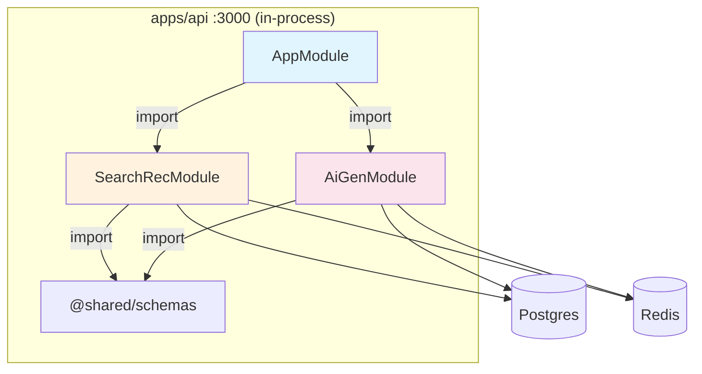
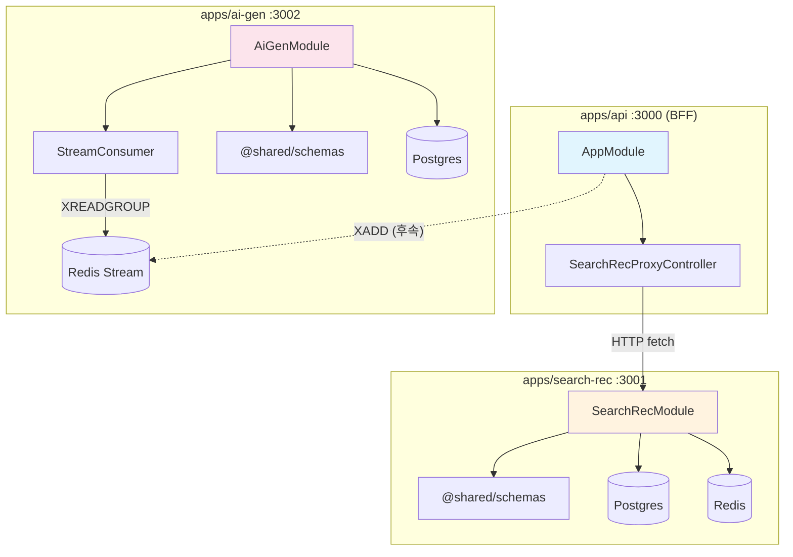

# ADR-0005: 모듈식 모놀리스 → MSA 전환 1단계

**상태**: accepted
**날짜**: 2026-07-22

## 컨텍스트

초기 아키텍처는 `apps/api`가 SearchRecModule과 AiGenModule을 직접 import 하는 모듈식 모놀리스였다. 검색 알고리즘 튜닝, 가드레일 정책 변경이 코어 API 재배포를 강제하고, 벡터 검색 장애가 상품 CRUD까지 다운시키는 문제가 있었다.

## 결정

### 추출 우선순위

| 기준 | search-rec | ai-gen | product/order | 비고 |
|:-----|:---:|:---:|:---:|:-----|
| **변경주기** 다름 | ✅ 알고리즘 튜닝 빈발 | ✅ 정책·프롬프트 분리 | ❌ 함께 바뀜 | |
| **리소스 프로파일** 다름 | ✅ CPU·벡터연산 집중 | ✅ 외부 LLM API 의존 | ❌ 범용 OLTP | |
| **장애 격리** 필요 | ✅ 검색 다운 ≠ CRUD 다운 | ✅ 소비 멈춤 ≠ 주문 멈춤 | ❌ 트랜잭션 공유 | |
| **결합 제거 비용** 낮음 | ✅ HTTP 프록시 전환 | ✅ 이미 이벤트로 분리 | ❌ saga 필요 | |

**규칙**: 3개 이상 ✅ → 추출 후보. search-rec·ai-gen 분리. product/order/payment/inventory는 saga 비용을 정당화할 기준 충족 전까지 모놀리스 유지.

### 통신 패턴

```
클라이언트 → apps/api (BFF :3000) ──HTTP──► apps/search-rec (:3001)
                                    └─XADD─► Redis Stream ─► apps/ai-gen (consumer, :3002 /health)
```

- **R(검색/추천) = 동기 HTTP**: apps/api가 `SEARCH_REC_URL`로 HTTP 프록시 — 직접 import 0
- **B(생성) = 비동기 이벤트**: ai-gen은 `ai:events` Stream consumer — 이미 분리되어 있음. producer는 seed 스크립트 (apps/api producer는 후속 과제)

### 의존도 — 분리 전 (모듈식 모놀리스)



### 의존도 — 분리 후 (MSA 1단계)



### 물리적 분리

- `modules/search-rec` → `apps/search-rec` (`@search/search-rec-app`, git mv로 히스토리 보존)
- `modules/ai-gen` → `apps/ai-gen` (`@ai/ai-gen-app`, 신규)
- `apps/api`: domain import 0 → `SearchRecProxyController`(HTTP forward) + `HealthController`
- 각 서비스: 자체 `main.ts` + NestJS app + `/health` + Dockerfile
- `docker-compose.yml`: 5개 서비스(postgres, redis, api, search-rec, ai-gen), 서비스명 DNS 통신, `depends_on: service_healthy`

## 결과

- 3개 서비스 독립 배포 가능 — 알고리즘/정책 변경이 코어 API 재기동 불필요
- 장애 격리 — search-rec 다운 시에도 BFF는 502 반환, ai-gen 다운 시에도 생성 지연만 발생
- 로컬 개발: 여전히 `pnpm exec tsx` 3개 프로세스로 가능 (containers 없이)

## 검증

| 항목 | 결과 |
|------|------|
| 직접 import 0 | `grep -rn "from '@(search\|ai)/" apps/api/src/` → 0건 |
| 3서비스 health | search-rec: `{pg:up, redis:up}`, ai-gen: `{pg:up, redis:up, consumer:running}`, api: `{searchRec:up}` |
| R 프록시 동작 | `/api/search`, `/api/recommend/home`, `/api/recommend/invalidate-home` → 모두 200/201 |
| B 이벤트 소비 | XADD → ai-gen consumer → `generated_contents(status=published)` |
| git diff | `{modules → apps}/search-rec/*` rename 23개, `apps/ai-gen/*` 17개 신규, `docker-compose.yml` 3서비스 추가, +2002/-95 |
| compose config | `docker compose config --services` → 5개 서비스 (postgres, redis, search-rec, ai-gen, api) |
| 추출 기준표 | ADR 본문에 4축 표 포함 — "왜 product는 안 뺐나"에 대한 영구 답변 |

## 정직 기록

- **Docker 빌드 미검증**: WSL 환경에서 Docker Hub 인증 오류로 `node:22-alpine` pull 불가. Dockerfile의 CMD는 로컬 3프로세스 `tsx` 실행으로 대체 검증 완료(동일 명령).
- **producer 부재**: `apps/api`에 이벤트 producer(XADD) 없음. ADR-0004의 정직 기록과 동일 — product/order 도메인 분리 시 함께 구현.
- **compose vs infra**: `infra/docker-compose.yml`은 로컬 개발용(postgres+redis만), 루트 `docker-compose.yml`은 전체 스택 통합용. 두 파일이 공존 — 혼동 주의.
- **app.module.ts 중복**: search-rec·ai-gen의 `app.module.ts`와 해당 모듈 내 provider들이 PG_POOL/REDIS_CLIENT를 각각 등록. NestJS module scope 덕분에 충돌 없음 — 각 HealthController는 자기 모듈의 provider를 참조.
