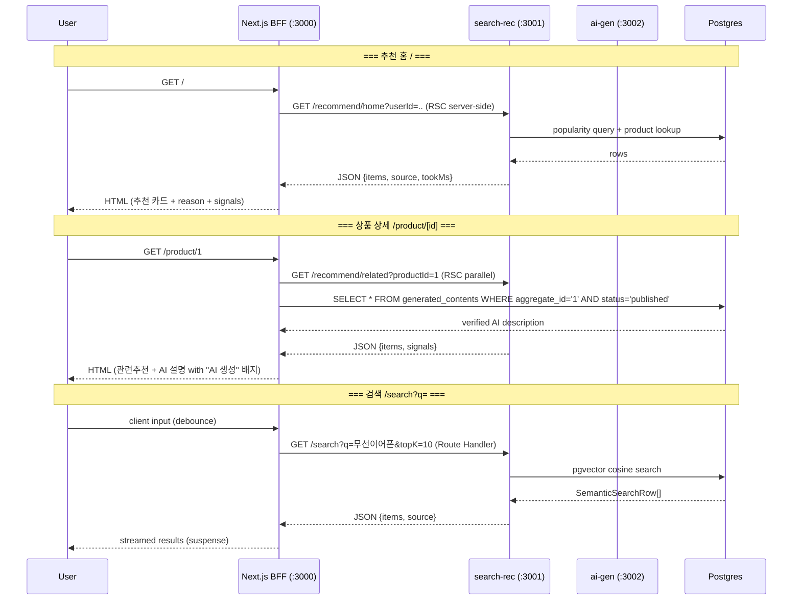

# ADR-0006: Next.js BFF 도입 (서버 컴포넌트 기반 MSA 집계)

**상태**: accepted
**날짜**: 2026-07-22

## 7개 판결표

| # | 항목 | 결정 | 트레이드오프 |
|---|------|------|-------------|
| **1** | **BFF 패턴** | 클라이언트는 MSA를 모름. Next.js RSC(서버 컴포넌트)/Route Handler가 `apps/search-rec`을 서버 사이드에서 fetch 집계. **클라이언트→MSA 직접 호출 0** — 모든 API는 BFF 경유. | 서버 부하 증가(중복 라운드트립) vs 클라이언트 복잡도 제거·보안(CORS·API 키 노출 방지). Next.js 자체가 SSR 가능. |
| **2** | **URL 관리** | `SEARCH_REC_URL`, `API_URL`을 `.env.local`(개발)과 docker-compose env(컨테이너)로 분리. Next 서버에서 `process.env` 읽음 — 클라이언트 번들에 노출 안 되도록 `NEXT_PUBLIC_` 프리픽스 없이. | 환경변수 누락 시 빌드 실패 vs 검증 스크립트로 방어. |
| **3** | **타입 공유** | MSA 응답을 `@shared/schemas`의 Zod 스키마로 `safeParse` — 런타임 검증 + TS 타입 추론. `apps/web`이 `packages/shared`를 workspace 의존성으로 import. | 빌드 시간 증가(shared 의존) vs 타입 불일치·파편화 방지. Zod parse 실패 시 fallback UI. |
| **4** | **가드레일 프론트** | 상품 상세의 AI 생성 설명: `WHERE status='published' AND verified_at IS NOT NULL`만 서버에서 fetch → **클라이언트는 status 필드를 모르고 렌더링만**. rejected·draft는 구조적으로 도달 불가. | 검증 실패한 설명은 영원히 안 보임(데이터 손실 아님 — DB에 보존, 재검증 가능) vs "빈 설명"이 사용자 경험 저하. 콜드스타트 기간 도 render null. |
| **5** | **설명 가능성** | 추천 카드: `reason`(텍스트) + `signals.combined`(pill 배지). 상세 펼침 시 `semantic`·`popularity`·`affinity` 막대 표시. | UI 노이즈 증가(reason+신호) vs 추천 신뢰도 상승. 카드에 signals는 collapsed 기본, click 시 expand. |
| **6** | **화면 3개** | `/` = 추천 홈 (cold_start_user), `/search?q=` = 의미론 검색 (trgm 폴백 배지), `/product/[id]` = 관련 추천 + AI 생성 description. 3개 모두 서버 컴포넌트 — 첫 로딩 시 SEO·Core Web Vitals 최적. | ISR/SSG 적용 어려움(추천은 per-user) vs SSR으로 충분(Next.js default). |
| **7** | **서버/클라이언트 경계** | **집계 = RSC**: 추천 목록·검색 결과·상품 데이터 fetch. **상호작용 = 클라이언트 컴포넌트**: 검색 입력(debounce 300ms)·신호 상세 toggle·invalidated home 새로고침. `'use client'` 지시어로 명시적 경계. | SSR 파편화(`'use client'` subtree는 hydrate) vs 점진적 적용 가능. RSC가 기본. |

## BFF 집계 흐름 (Mermaid)



## 디자인 시스템 (DESIGN.md 기반)

| 요소 | 값 | 적용 |
|------|-----|------|
| 악센트 컬러 | `#635BFF → #7A73FF` 그라디언트 | CTA, 활성 링크, signal 배지 |
| 배경 | `#F6F9FC` | 페이지 배경 |
| 카드 | `border-radius: 8px`, `box-shadow: 0 1px 3px rgba(0,0,0,0.1)` | ProductCard |
| 타이포 | Inter/Geist, weight-300(본문), 400(캡션), 500(제목) | globals.css |
| Signal 배지 | Pill shape, `combined`만 카드에, 상세는 펼침 | SignalBadge |
| AI 생성 배지 | 테라코타 `#D97757`, "AI 생성" | AI 설명 영역 |
| 폴백 배지 | 노란색 `#F5A623`, "키워드 검색" | trgm fallback 시 |

## 디렉토리 구조 (apps/web)

```
apps/web/
├── package.json              # next, react, @shared/schemas
├── next.config.ts            # env, images, cors
├── tsconfig.json             # extends root, paths
├── .env.local                # SEARCH_REC_URL=http://localhost:3001 (개발)
├── src/
│   ├── app/
│   │   ├── layout.tsx        # 글로벌 스타일, 헤더
│   │   ├── page.tsx          # / 추천 홈 (RSC)
│   │   ├── search/
│   │   │   └── page.tsx      # /search?q= (RSC + client searchbar)
│   │   └── product/
│   │       └── [id]/
│   │           └── page.tsx  # /product/[id] (RSC + related + AI desc)
│   ├── components/
│   │   ├── ProductCard.tsx   # 카드 (reason + signal badge)
│   │   ├── SearchBar.tsx     # 'use client' — debounce 검색
│   │   ├── SignalBadge.tsx   # pill 배지 (combined / semantic / popularity)
│   │   └── FallbackBadge.tsx # 폴백 표시
│   └── lib/
│       ├── api.ts            # typed fetch wrapper → search-rec
│       └── types.ts          # 검증된 Zod 타입 (safeParse 결과)
```

## 타입 안전 계층

```ts
// lib/types.ts
import { SearchResponseSchema, RecommendResponseSchema, GeneratedContentDbSchema } from '@shared/schemas';

export async function fetchRecommendHome(userId: string, topK: number) {
  const res = await fetch(`${SEARCH_REC_URL}/recommend/home?userId=${userId}&topK=${topK}`);
  const json = await res.json();
  return RecommendResponseSchema.parse(json); // Zod → TypeScript type
}
```

이렇게 하면 `apps/web`의 모든 데이터 접근이:
1. fetch 호출
2. `shared`의 Zod 스키마로 파싱
3. 파싱 실패 시 500 또는 fallback UI
4. 성공 시 타입 안전한 TS 객체 반환

이를 통해 **MSA 경계를 존중하면서** (직접 import 0, shared만 공유) **타입 안전성**을 확보한다.
