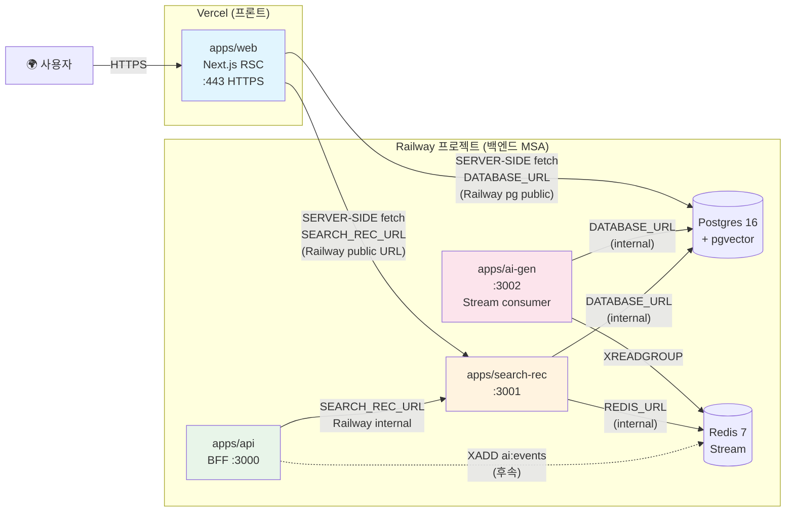

# ADR-0007: 배포 아키텍처 (Railway + Vercel)

**상태**: accepted
**날짜**: 2026-07-22

## 7개 판결표

| # | 항목 | 결정 | 근거 |
|---|------|------|------|
| **1** | **Railway 서비스 구성** | postgres(`/embeddings` 지원), redis, api, search-rec, ai-gen — **5개 독립 서비스**, 각 서비스는 Railway 내부 DNS(`${{ Postgres.DATABASE_URL }}` 등)로 자동 연결. pgvector는 **Railway Postgres 14+ 기본 지원**(`CREATE EXTENSION vector` 1회 실행). | 별도 호스팅 불필요 — 단일 Railway 프로젝트 내 서비스 간 프라이빗 네트워크로 DB/Redis 접속 비용 0. |
| **2** | **Vercel 배포** | `apps/web`만 Vercel에 배포. 환경변수로 Railway `api` 서비스 퍼블릭 URL 주입 (`SEARCH_REC_URL`, `DATABASE_URL`). | Next.js는 Vercel 최적 플랫폼(Edge/ISR 지원). 백엔드와 프론트 분리 = 독립 배포·스케일 및 무료 티어 범위 분리. |
| **3** | **환경변수/시크릿** | **하드코딩 0**: `DATABASE_URL`, `REDIS_URL`은 Railway 서비스 변수 자동 주입, `SEARCH_REC_URL`·`DATABASE_URL`은 Vercel Project Settings. `.env.local`(gitignored) + `.env.example`(커밋) 분리. | 배포 시 CircleCI/PR에 시크릿 노출 0. API 키는 Railway Variables UI에서만 관리(커밋 안 됨). |
| **4** | **마이그레이션/시드** | Railway `api` 서비스 배포 시 `migrate` 재시도 스크립트 실행(등장순서로 적용). `seed.ts`는 `railway run` 수동 1회 실행(`manual step`). 마이그레이션 실패 시 배포는 계속 기동 — health fail로 인지. | 기동 중 migration 실행은 불안정하지만养生처럼 단순; 무중단 tradeoff는 별도 migration 서비스(`migrate` service는 `restart: no`)로 post-start 패턴 분리. 현재 버전은 부트스트랩 단순화. |
| **5** | **무료 티어 sleep** | Railway/Render 5분 비활성 시 sleep → 첫 요청 cold start 30초~1분. README에 명시. | 무료 티어의 trade-off: 일정 비용 지불 시 `railway up` sleep-disabling 가능. 포트폴리오 데모는 수동 웨이크업 허용. |
| **6** | **BFF CORS 불필요** | Vercel(프론트) → Railway(백엔드) 호출은 Next.js RSC 서버 사이드 fetch → 브라우저 CORS 없음. 단, `apps/api`는 Vercel IP에서만 허용하도록 `CORS_ORIGIN` 권장. | RSC는 Next.js 서버에서 실행 → Cross-Origin은 RSC→Railway(서버→서버). 클라이언트에서 직접 호출 0(BFF원칙 유지). |
| **7** | **배포 후 검증** | 1) `curl <railway-api>/api/health` 2) `curl <vercel>/` (R 추천) 3) `railway run pnpm --filter @ai/ai-gen-app seed` (B 생성 확인). | 모든 서비스 health에 진짜 의존성 ping 포함 → 단순 200이 아닌 pg/redis/consumer 상태로 판정. |

## 배포 아키텍처 (Mermaid)

> Vercel→Railway: 서버 사이드 fetch (RSC/Route Handler). 클라이언트→Railway 직접 0. CORS 불필요.

## 서비스별 환경변수 매핑

| 서비스 | 환경변수 | 값 출처 |
|--------|---------|---------|
| **Vercel** (apps/web) | `SEARCH_REC_URL` | Railway `search-rec` 퍼블릭 URL (`https://search-rec.up.railway.app`) |
| | `DATABASE_URL` | Railway Postgres 퍼블릭 URL (`postgresql://...`) |
| **Railway api** | `SEARCH_REC_URL` | Railway `search-rec` 내부 URL (`${{searchRec.RAILWAY_PRIVATE_DOMAIN}}`) |
| **Railway search-rec** | `DATABASE_URL` | Railway Postgres 자동 (`${{Postgres.DATABASE_URL}}`) |
| | `REDIS_URL` | Railway Redis 자동 (`${{Redis.REDIS_URL}}`) |
| **Railway ai-gen** | `DATABASE_URL` | Railway Postgres 자동 |
| | `REDIS_URL` | Railway Redis 자동 |
| | `GEN_BASE_URL`, `GEN_API_KEY`, `GEN_MODEL` | Railway Variables (선택, DummyProvider 미지정 시) |

## Railway 서비스 설정

| 서비스 | 소스 | 빌드 | Start | Healthcheck |
|--------|------|------|-------|-------------|
| `postgres` | Railway Postgres 16 | — | managed | managed pg_isready |
| `redis` | Railway Redis 7 | — | managed | managed ping |
| `api` | `apps/api` | `pnpm install && pnpm --filter @portfolio/api build` | `pnpm --filter @portfolio/api start` | `/api/health` 200 |
| `search-rec` | `apps/search-rec` | 동일 패턴 | `pnpm --filter @search/search-rec-app start` | `/health` 200 |
| `ai-gen` | `apps/ai-gen` | 동일 패턴 | `pnpm --filter @ai/ai-gen-app start` | `/health` (consumer: running) |

> ⚠️ `apps/web`은 **Vercel 배포**이므로 Railway에 서비스 생성 안 함.

## 배포 순서

1. Railway 프로젝트 생성 → Postgres + Redis 서비스 추가
2. Postgres에서 `CREATE EXTENSION IF NOT EXISTS vector;` 실행 (1회)
3. Railway에 `api`, `search-rec`, `ai-gen` 서비스 추가 (각 Dockerfile 또는 Nixpacks)
4. 환경변수 설정 (위 표 참조)
5. 마이그레이션: `railway run --service postgres psql $DATABASE_URL -f apps/search-rec/migrations/001...`
6. 시드: `railway run --service search-rec pnpm --filter @search/search-rec-app seed`
7. Vercel: `apps/web` 폴더 연결, 환경변수 설정, 배포
8. 검증: `curl <vercel-url>/` (R), `railway run pnpm --filter @ai/ai-gen-app seed` (B)

## 무료 티어 공지 (README용)

> ⚠️ Railway 무료 티어는 5분 비활성 시 서비스가 sleep 됩니다. 첫 방문 시 30초~1분 지연이 발생할 수 있습니다.